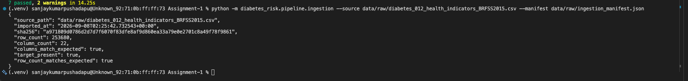

# Diabetes Risk Prediction Using Health and Lifestyle Indicators

Group 49 — final submission report content. Built step by step per
`Assignment_1_Workload_Plan.md`. Everyone edits this same file — add your
section's content under the matching heading below.

---

## 1. Business Understanding, Dataset, and Ingestion

### 1.1 Introduction

This report documents Group 49's Assignment 1 submission for AIMLCZG549 (API-Driven Cloud-Native Solutions): a cloud-based, API-accessible data pipeline for **diabetes risk screening from health and lifestyle indicators**. The pipeline ingests a public health survey dataset, validates and preprocesses it, runs exploratory data analysis, and re-executes automatically on a fixed schedule, with results exposed through both a cloud dashboard and a documented REST API (Swagger/OpenAPI). Section 1 below covers Person 1's work package -- business understanding, dataset selection, and data ingestion -- which the rest of the pipeline (Sections 2-4) builds on.

### 1.2 Project topic

**Diabetes Risk Prediction Using Health and Lifestyle Indicators**

### 1.3 Business problem

Healthcare organizations collect large volumes of patient health and lifestyle data — clinical measurements, lifestyle habits, and demographic indicators — but converting that data into early diabetes-risk screening is difficult in practice. Manual chart-by-chart review does not scale across thousands of patient records, so at-risk individuals are often identified only after symptoms are already present or during unrelated visits, rather than through proactive screening.

This delay has real consequences: patients who could have benefited from early lifestyle intervention or monitoring progress to more advanced, harder-to-manage risk levels, and healthcare providers face higher downstream treatment costs and heavier caseloads that could have been reduced with earlier flagging.

An automated, data-driven risk-screening pipeline addresses this by continuously analyzing available health and lifestyle indicators (e.g., BMI, blood pressure, cholesterol, physical activity, general health status) and surfacing individuals whose profile suggests elevated diabetes risk — long before manual review would catch them.

**Who uses the results:** primarily healthcare providers and care coordinators, who can use the risk-screening output to prioritize outreach and preventive care for higher-risk patients, and secondarily program administrators, who can use the aggregated dashboard view to understand risk distribution across a patient population. The output is explicitly a **risk-screening signal**, not a diagnosis — final clinical decisions remain with a qualified provider.

### 1.4 Current and proposed states

**Current state**

Patient health and lifestyle data is already being collected by healthcare organizations and public health surveys, but it sits largely underused for proactive screening. Identifying which individuals carry elevated diabetes risk still depends on manual review of records or waiting for a clinical visit to prompt investigation, which is time-consuming and inconsistent across large patient populations. Because this analysis is not automated, insights are generated infrequently — often too late to inform early, preventive action — and there is no continuous, systematic way to flag risk as new data arrives.

**Proposed state**

Health and lifestyle data flows through an automated cloud-based pipeline that ingests the dataset, checks and cleans it, and analyzes diabetes-risk indicators (BMI, blood pressure, cholesterol, activity level, general health, etc.) without manual intervention. This analysis reruns on a fixed schedule, so results stay current rather than being a one-time snapshot. The outcomes — risk indicators, key drivers, and pipeline activity — are made visible through a cloud dashboard and exposed through APIs, giving healthcare providers and administrators continuous, up-to-date visibility into risk patterns instead of periodic manual reviews.

### 1.5 Objectives and benefits

**Objectives**

- Ingest and validate a real, sufficiently large public health dataset (BRFSS 2015 diabetes indicators) with automated checks on schema, target column, and row count.
- Preprocess and clean the data (missing-value handling, encoding, normalization) so it is ready for repeatable analysis.
- Run exploratory data analysis (distribution, correlation, binning, feature importance) to surface diabetes-risk indicators.
- Automate the full pipeline on a fixed (2-minute) schedule with execution logging, so results stay current without manual reruns.
- Expose pipeline results and at least four application operations through a documented, testable REST API (Swagger/OpenAPI), and visualize them on a cloud dashboard.

**Benefits**

- **For healthcare providers/care coordinators:** a continuously updated risk-screening signal that helps prioritize outreach to higher-risk patients, instead of relying on manual chart review.
- **For program administrators:** an aggregated dashboard view of risk distribution across a patient population, supporting resource and program planning.
- **For the team:** a working, end-to-end demonstration of the assignment's required architecture (ingestion -> preprocessing -> EDA -> scheduled DataOps -> API layer), directly mapped to the grading rubric.

As with the rest of this report, all outputs are a **risk-screening signal**, not a clinical diagnosis.

### 1.6 Dataset profile

- **Filename:** `diabetes_012_health_indicators_BRFSS2015.csv`
- **Source:** Kaggle — Diabetes Health Indicators Dataset (https://www.kaggle.com/datasets/alexteboul/diabetes-health-indicators-dataset)
- **Row count:** 253,680
- **Column count:** 22
- **Target column:** `Diabetes_012` (0 = no diabetes, 1 = prediabetes, 2 = diabetes)
- **Feature columns:** `HighBP`, `HighChol`, `CholCheck`, `BMI`, `Smoker`, `Stroke`, `HeartDiseaseorAttack`, `PhysActivity`, `Fruits`, `Veggies`, `HvyAlcoholConsump`, `AnyHealthcare`, `NoDocbcCost`, `GenHlth`, `MentHlth`, `PhysHlth`, `DiffWalk`, `Sex`, `Age`, `Education`, `Income`
- **Data types:** All 22 columns are stored as numeric (float64); several are binary flags (0/1) or ordinal codes (e.g. `GenHlth` 1–5, `Age` bucketed 1–13, `Income` 1–8) rather than free-form categories.
- **Missing values:** 0 across all columns (independently verified against the raw CSV).
- **Target-value distribution:** 0.0 → 213,703 (84.2%), 1.0 → 4,631 (1.8%), 2.0 → 35,346 (13.9%) — notably imbalanced, especially the prediabetes class.

**Why this is sufficient:** At 253,680 rows, even the smallest class (prediabetes, 4,631 rows) comfortably supports EDA (correlation analysis, binning, feature importance) and, if a model is included, a held-out test split — a standard 80/20 split still leaves roughly 900+ minority-class examples for evaluation. The dataset's scale also means a full preprocessing + EDA pass is fast enough to comfortably fit inside the assignment's every-2-minute scheduled run.

**Evidence -- raw dataset source (Kaggle):**


### 1.7 Data dictionary

All columns are stored as numeric (float64); "Role" marks the prediction target vs. feature. Ranges below are confirmed against the raw CSV, not assumed.

| Column | Business meaning | Values | Role |
|---|---|---|---|
| `Diabetes_012` | Diabetes status | 0 = no diabetes, 1 = prediabetes, 2 = diabetes | Target |
| `HighBP` | Diagnosed with high blood pressure | 0 = no, 1 = yes | Feature (binary) |
| `HighChol` | Diagnosed with high cholesterol | 0 = no, 1 = yes | Feature (binary) |
| `CholCheck` | Cholesterol checked in past 5 years | 0 = no, 1 = yes | Feature (binary) |
| `BMI` | Body Mass Index | 12–98 (continuous) | Feature (numeric) |
| `Smoker` | Smoked ≥100 cigarettes in lifetime | 0 = no, 1 = yes | Feature (binary) |
| `Stroke` | Ever told had a stroke | 0 = no, 1 = yes | Feature (binary) |
| `HeartDiseaseorAttack` | Coronary heart disease or myocardial infarction | 0 = no, 1 = yes | Feature (binary) |
| `PhysActivity` | Physical activity in past 30 days (excl. job) | 0 = no, 1 = yes | Feature (binary) |
| `Fruits` | Consumes fruit ≥1×/day | 0 = no, 1 = yes | Feature (binary) |
| `Veggies` | Consumes vegetables ≥1×/day | 0 = no, 1 = yes | Feature (binary) |
| `HvyAlcoholConsump` | Heavy alcohol consumption (men >14, women >7 drinks/week) | 0 = no, 1 = yes | Feature (binary) |
| `AnyHealthcare` | Has any healthcare coverage | 0 = no, 1 = yes | Feature (binary) |
| `NoDocbcCost` | Needed a doctor but couldn't afford it (past 12 mo.) | 0 = no, 1 = yes | Feature (binary) |
| `GenHlth` | Self-rated general health | 1 = excellent … 5 = poor (ordinal) | Feature (ordinal) |
| `MentHlth` | Days of poor mental health, past 30 days | 0–30 (count) | Feature (numeric) |
| `PhysHlth` | Days of poor physical health, past 30 days | 0–30 (count) | Feature (numeric) |
| `DiffWalk` | Serious difficulty walking/climbing stairs | 0 = no, 1 = yes | Feature (binary) |
| `Sex` | Sex | 0 = female, 1 = male | Feature (binary) |
| `Age` | 13-level age bracket | 1 = 18–24 … 13 = 80+ (ordinal) | Feature (ordinal) |
| `Education` | Education level | 1 = none/kindergarten … 6 = college 4+ years (ordinal) | Feature (ordinal) |
| `Income` | Household income bracket | 1 = <$10k … 8 = $75k+ (ordinal) | Feature (ordinal) |

### 1.8 Suitability and limitations

**Why this dataset suits the assignment**

- **Scale:** 253,680 rows is large enough for statistically meaningful correlation analysis, binning, and feature importance, and still leaves a workable minority-class sample (4,631 rows) if a held-out model evaluation is added.
- **Feature mix:** binary flags (`HighBP`, `Smoker`, …), ordinal scales (`GenHlth`, `Age`, `Education`, `Income`), and continuous counts (`BMI`, `MentHlth`, `PhysHlth`) together give real material for every required EDA activity — correlation, binning, encoding, and univariate/bivariate analysis.
- **Target:** a 3-class label (`Diabetes_012`) supports classification and feature-importance work if the optional model is included, and its imbalance is itself a useful, honest talking point for the EDA/evaluation write-up.
- **Automation-friendly:** no missing values and a manageable file size (~23 MB) mean a full preprocessing + EDA pass runs quickly — important for the every-2-minute scheduled workflow.

**Source and licensing**

Derived from the CDC's public **Behavioral Risk Factor Surveillance System (BRFSS) 2015** survey, cleaned and republished on Kaggle by Alex Teboul (https://www.kaggle.com/datasets/alexteboul/diabetes-health-indicators-dataset) and also mirrored on the UCI Machine Learning Repository. The original 2015 BRFSS survey collected responses from 441,455 individuals across 330 features; this cleaned file keeps 253,680 responses and 21 feature variables plus the target.

**License:** CC0: Public Domain (confirmed directly on the Kaggle dataset page). No attribution or usage restriction applies, though the CDC's original BRFSS data should still be credited as the underlying source in the final report.

**Limitations**

- **Self-report bias:** all fields are self-reported survey answers (smoking, alcohol use, activity, etc.), which are known to be subject to recall error and social-desirability bias (e.g., under-reporting alcohol consumption or over-reporting physical activity).
- **Dataset age:** collected in 2015 — over a decade old, so absolute rates (e.g., smoking, obesity) may not reflect current populations.
- **Generalization:** BRFSS is a U.S.-only telephone survey; findings should not be generalized to non-U.S. populations, and telephone-survey methodology can under-represent some demographic groups.
- **Bias and fairness:** `Income`, `Education`, and `AnyHealthcare`/`NoDocbcCost` reflect healthcare-access disparities as much as biological risk — correlations involving these fields should be discussed as access/equity signals, not purely clinical ones. `Sex` is recorded as a binary field only, per the original survey design.
- **Not a diagnosis:** consistent with the rest of this report, all outputs are a **risk-screening signal**, not a clinical diagnosis, and must not be presented or used as one.

### 1.9 Data ingestion evidence

Implemented as `src/diabetes_risk/pipeline/ingestion.py` (`ingest()`), covering the required checks: file opens successfully, all 21 expected feature columns plus the `Diabetes_012` target are present, and the row count is recorded and compared against the verified profile (253,680). The raw CSV is never modified or duplicated -- each ingestion run instead appends a timestamped, SHA-256-hashed entry to `data/raw/ingestion_manifest.json`, so the exact file used stays verifiable and any future drift (a different file swapped in under the same name) would be visible immediately as a hash or row-count change.

Run with:

```bash
python -m diabetes_risk.pipeline ingest --source data/raw/diabetes_012_health_indicators_BRFSS2015.csv --manifest data/raw/ingestion_manifest.json
```

(The screenshot below was captured before the pipeline's commands were consolidated into one CLI, so it shows the earlier form `python -m diabetes_risk.pipeline.ingestion ...` -- the result is identical either way, since the underlying `ingest()` function didn't change.)

**Verified result (first import):**

```json
{
  "source_path": "data/raw/diabetes_012_health_indicators_BRFSS2015.csv",
  "imported_at": "2026-09-07T17:10:57.174896+00:00",
  "sha256": "a971809d0786d2d7d7f6070f83dfe8af9d860ea33a79e0e2701c8a49f78f9861",
  "row_count": 253680,
  "column_count": 22,
  "columns_match_expected": true,
  "target_present": true,
  "row_count_matches_expected": true
}
```

Processed output (Person 2's stage) is written to `data/processed/`, kept separate from `data/raw/` so the original file is always preserved untouched. Covered by 5 automated tests in `tests/test_ingestion.py` (valid file, manifest append behavior, missing target column, missing feature column, missing file).

**Evidence — terminal run (Person 1's machine):**



All 7 tests pass, and the ingestion run against the real dataset matches the result recorded above exactly (same SHA-256 hash, same row/column counts), confirming it's reproducible outside the verification environment too.

**Person 1 is now complete** -- topic confirmed, business problem written, dataset profiled and verified against the real file, data dictionary complete, suitability/limitations documented with a confirmed CC0 license, and raw data ingested, validated, and logged for Person 2 to build on.

---

## 2. Data Quality, Preprocessing, and Pipeline Automation

### 2.1 Person 2 scope

Person 2's work package covers **data-quality validation, preprocessing, automated EDA generation, DataOps execution, two-minute scheduling, execution logging, verification, and handoff to Person 3**. The implementation is deliberately platform-neutral so that the same Python processing code can run locally or under Apache Airflow, with Google Cloud Composer documented as the planned production orchestration environment.

The raw dataset supplied by Person 1 remains immutable. All transformed datasets, analytical artifacts, and execution logs are written to separate `data/processed/` and `data/outputs/` locations.

### 2.2 Data-quality validation

Person 2 implemented a reusable validation module in `src/diabetes_risk/pipeline/data_quality.py`. The module validates the approved dataset before preprocessing and produces machine-readable quality results.

The implemented checks include:

- Schema and target-column validation
- Row and column counts
- Pandas data types
- Summary statistics
- Missing-value counts and percentages
- Exact duplicate-record detection
- Target-value validation (`Diabetes_012` must contain only 0, 1, or 2)
- Known numeric-range validation
- Binary indicator validation (0/1)

**Verified source dataset:** `data/raw/diabetes_012_health_indicators_BRFSS2015.csv`

| Quality check | Verified result |
|---|---:|
| Input records | 253,680 |
| Input columns | 22 |
| Missing values | 0 |
| Exact duplicate records | 23,899 (9.42%) |
| Invalid target values | 0 |
| Invalid known numeric-range values | 0 |
| Invalid binary values | 0 |
| Quality status | `PASS_WITH_WARNINGS` |

The duplicate records are treated as a **non-fatal quality warning**, rather than a schema or data-validity failure. The raw file is preserved unchanged, while exact duplicates are removed during preprocessing.

Quality artifacts generated by the pipeline are:

```text
data/outputs/quality/data_quality.json
data/outputs/quality/missing_values.csv
```

### 2.3 Preprocessing and cleaned-data generation

Person 2 implemented the transformation contract in `src/diabetes_risk/pipeline/preprocessing.py`. The preprocessing flow is applied consistently on every pipeline execution:

1. Normalize column names to lowercase snake case for downstream processing consistency.
2. Detect and remove exact duplicate records, retaining the first occurrence.
3. Median-impute numeric missing values where required.
4. Mode-impute non-numeric values where required.
5. One-hot encode non-numeric categorical fields where required.
6. Preserve existing binary and ordinal indicators in interpretable form.
7. Keep the target separate from feature standardization.
8. Write an analytical cleaned dataset for Person 3.
9. Write a separate standardized model-ready dataset for optional downstream model work.

For the current approved dataset, no imputation was required because the raw file contains **zero missing values**. Likewise, no one-hot categorical encoding was required in the current run because the dataset fields are already represented as numeric, binary, or ordinal values.

The current execution produced:

| Output | Result |
|---|---:|
| Input rows | 253,680 |
| Exact duplicates removed | 23,899 |
| Cleaned analytical rows | 229,781 |
| Cleaned columns | 22 |
| Model-ready rows | 229,781 |
| Model-ready columns | 22 |

### 2.4 Analytical cleaned dataset vs. model-ready dataset

Two processed datasets are intentionally maintained rather than applying the same transformation to both analytical and modelling use cases.

**`data/processed/diabetes_cleaned.csv`** is the primary handoff to Person 3. It retains the original, interpretable feature scales so that BMI, health-day counts, age groups, and other indicators remain meaningful in EDA charts and tables.

**`data/processed/diabetes_model_ready.csv`** is a separate downstream modelling output. Z-score standardization is applied to the continuous/count fields `BMI`, `MentHlth`, and `PhysHlth`, while binary and ordinal indicators remain interpretable and the target is not scaled.

This separation satisfies the assignment's normalization/standardization requirement without making the EDA outputs harder to interpret. It also leaves Person 3 free to use the model-ready dataset if the optional prediction model is included.

The preprocessing module writes its transformation summary to:

```text
data/processed/preprocessing_report.json
```

### 2.5 Automated EDA artifact generation

Person 2 automated the **generation** of the EDA artifacts in `src/diabetes_risk/pipeline/eda.py`. Person 3 remains responsible for the analytical interpretation and final EDA narrative.

Each successful pipeline run refreshes the following outputs required by the workload plan:

- Summary statistics
- Missing-value summary
- Target-distribution table and chart
- Feature-distribution charts
- Correlation matrix
- Selected bivariate tables and charts
- Age/BMI binned features
- EDA metadata

The automated feature-distribution outputs cover eight selected indicators:

- BMI
- Age
- General Health
- High Blood Pressure
- High Cholesterol
- Physical Activity
- Cholesterol Check
- Smoking

The automated bivariate outputs cover six selected relationships against the diabetes target:

- BMI vs. target
- Age vs. target
- High Blood Pressure vs. target
- High Cholesterol vs. target
- Physical Activity vs. target
- General Health vs. target

This design allows the EDA artifacts to be refreshed automatically without requiring Person 3 to rerun notebooks or manually regenerate charts.

### 2.6 End-to-end DataOps runner

`src/diabetes_risk/pipeline/runner.py` provides the single end-to-end execution path used for both local execution and Airflow orchestration:

```text
Raw CSV
  ↓
Data-quality validation
  ↓
Preprocessing
  ├── diabetes_cleaned.csv
  └── diabetes_model_ready.csv
  ↓
Automated EDA artifact generation
  ↓
Structured execution log
```

The runner records the status of each execution and writes outputs to predictable locations. The verified full-dataset local execution (run ID `20260909T063214670950Z`) started at `2026-09-09T06:32:14.670942Z`, completed at `2026-09-09T06:32:31.222395Z`, and finished in **16.55 seconds**. It read all **253,680** raw records and produced the expected 229,781-row processed outputs.

### 2.7 Verified full-dataset execution result

To remove ambiguity about the size of the data actually processed, Person 2 retained **one fresh successful end-to-end run only** against the complete raw CSV. No two-record test fixture is represented in the retained pipeline outputs or execution results. The test suite continues to use small fixtures for unit testing, but the execution documented here is the full production-like local run against the 253,680-row source file.

| Execution metric | Verified result |
|---|---:|
| Run ID | `20260909T063214670950Z` |
| Input file | `data/raw/diabetes_012_health_indicators_BRFSS2015.csv` |
| Input rows read | **253,680** |
| Input columns | **22** |
| Missing values | **0** |
| Exact duplicate records detected | **23,899 (9.42%)** |
| Rows after duplicate removal | **229,781** |
| Cleaned dataset | **229,781 × 22** |
| Model-ready dataset | **229,781 × 22** |
| Invalid target values | **0** |
| Invalid known numeric-range values | **0** |
| Invalid binary values | **0** |
| Quality status | `PASS_WITH_WARNINGS` |
| Execution status | `SUCCESS` |
| Runtime | **16.55 seconds** |

The deduplicated target distribution used by the refreshed EDA artifacts is:

| `Diabetes_012` | Records | Percentage |
|---:|---:|---:|
| 0 | 190,055 | 82.71% |
| 1 | 4,629 | 2.01% |
| 2 | 35,097 | 15.27% |
| **Total** | **229,781** | **100.00%** |

The original raw target distribution documented in Section 1 remains unchanged; the table above reflects the **post-duplicate-removal dataset** used for Person 2's refreshed EDA outputs. The raw CSV itself remains immutable.

The authoritative execution record is stored at:

```text
data/outputs/execution/run_20260909T063214670950Z.json
data/outputs/execution/latest_run.json
```

The generated EDA artifacts, quality report, cleaned dataset, and model-ready dataset all correspond to this same full-dataset execution.

### 2.7 Execution logging and monitoring information

Person 2 implemented `src/diabetes_risk/pipeline/logging_utils.py` for structured JSON execution logging. Each pipeline run records:

- Unique run ID
- Start timestamp
- End timestamp
- Runtime duration
- Execution status
- Number of input/processed records
- Number of output records
- Duplicate count
- Errors
- Warnings
- Quality status
- Processed-output locations
- EDA-output locations

Execution artifacts are written under:

```text
data/outputs/execution/run_<run_id>.json
data/outputs/execution/latest_run.json
```

For the verified final local execution (`20260909T063214670950Z`), the execution status was **`SUCCESS`**, the quality status was **`PASS_WITH_WARNINGS`**, **253,680** records were read and processed, **23,899** exact duplicates were detected and removed, and **229,781** records were written to both the cleaned and model-ready outputs. No missing, invalid-target, invalid-known-range, or invalid-binary values were detected.

### 2.8 Airflow orchestration and two-minute schedule

`dags/diabetes_risk_pipeline.py` implements the orchestration layer using **Apache Airflow**. The DAG is intentionally cloud agnostic and invokes the same platform-neutral Python runner used for local execution.

The DAG contains no GCP SDK imports, GCS-specific operators, Vertex AI operators, or cloud credentials. This preserves a clean separation between the processing application and its deployment environment.

The configured schedule is:

```text
*/2 * * * *
```

Therefore, the workflow is designed to trigger **every two minutes**, including the data-quality checks, preprocessing, and automated EDA generation rather than only the ingestion step.

The reliability configuration includes:

- `catchup=False` to avoid replaying historical schedules during deployment.
- `max_active_runs=1` to prevent overlapping pipeline executions.
- One retry with a one-minute retry delay for transient task failures.

The planned production deployment target is **Google Cloud Composer**, which provides managed Apache Airflow. GCP-specific deployment notes are isolated under `infra/gcp/`, while the core Python processing and DAG remain portable.

### 2.9 Configuration and local execution

Person 2 added environment-driven configuration through `src/diabetes_risk/pipeline/config.py` and a unified command-line entry point through `src/diabetes_risk/pipeline/cli.py`.

The pipeline can therefore be executed locally without GCP dependencies. The main commands are:

```bash
python -m diabetes_risk.pipeline ingest
python -m diabetes_risk.pipeline run
```

The default configuration uses the repository's raw dataset and separates processed and reporting outputs. Environment variables can override the dataset, target column, processed-output directory, and report-output directory when the same code is deployed to another environment.

### 2.10 Verification and test results

The Person 2 implementation was verified using both automated tests and an end-to-end run against the real repository dataset.

**Automated verification:**

```text
17 passed, 1 skipped
```

The one skipped test is Airflow-specific because an Airflow runtime is not installed in the local development environment. Airflow is intentionally kept outside the core Python dependency set because it is expected to be supplied by the orchestration runtime, such as Cloud Composer.

Additional validation completed successfully:

- Python source compilation using `compileall`
- Repository whitespace validation using `git diff --check`
- End-to-end execution against the actual 253,680-row raw CSV
- Generated processed datasets and EDA artifacts verified at the expected output locations

### 2.11 Person 2 evidence

The Person 2 evidence index is maintained under `docs/evidence/person2/`. The local validation record documents the actual data-quality, preprocessing, output, test, and scheduling results.

The verified local evidence includes:

- Dataset validation
- Summary statistics and data types
- Missing-value results
- Duplicate-record results
- Invalid-value results
- Preprocessing results
- Cleaned dataset output
- Model-ready output
- Automated EDA outputs
- Structured execution log
- Airflow DAG configuration

**Deployment-time evidence still required:** screenshots of **two consecutive scheduled runs approximately two minutes apart**, including trigger time, completion status, distinct execution-log entries, and refreshed EDA timestamps. These screenshots have deliberately not been fabricated because Cloud Composer/Airflow deployment evidence is environment-specific.

### 2.12 Handoff to Person 3

Person 2's primary analytical handoff is:

```text
data/processed/diabetes_cleaned.csv
```

The handoff includes the cleaned dataset, preprocessing contract, data-quality results, automated EDA outputs, execution logs, and documentation. Person 3 should use `diabetes_cleaned.csv` for interpretable EDA and may use `diabetes_model_ready.csv` if an optional prediction model is included.

The automated EDA contract provides target distribution, selected feature distributions, correlation results, selected bivariate analyses, and Age/BMI binning. Person 3 owns interpretation of these outputs and any optional model development.

Person 2 does **not** implement model training, model deployment, final dashboarding, or the four required application APIs; those remain with the subsequent work packages defined in the project plan.

### 2.13 Person 2 completion statement

Person 2 is complete for the local implementation stage: the approved dataset has been validated, quality checks and preprocessing are automated, cleaned and model-ready datasets are generated, EDA artifacts are refreshed by the workflow, structured execution logging is implemented, the Airflow DAG is configured for the required two-minute schedule with an explicit overlapping-run policy, and the complete implementation has passed the available automated verification suite.

The only remaining Person 2 evidence item is deployment-time proof of consecutive scheduled Airflow/Cloud Composer runs once the team's cloud environment is available.

---

## 3. EDA, Optional Model, and Dashboard Analysis

_Pending._

---

## 4. Dashboard, APIs, and Demonstration

_Pending._
