# Diabetes Risk Prediction Using Health and Lifestyle Indicators

**Course:** AIMLCZG549 — API-Driven Cloud-Native Solutions
**Assignment:** Assignment I
**Group:** 49
**Institution:** BITS Pilani, Work Integrated Learning Programmes

This report documents the design, implementation, and verification of a cloud-based,
API-accessible data pipeline for diabetes-risk screening from health and lifestyle
indicators, delivered as four work packages:

1. Business understanding, dataset selection, and ingestion.
2. Data-quality validation, preprocessing, and scheduled pipeline automation.
3. Exploratory data analysis and an optional predictive-model comparison.
4. Dashboard, APIs, and demonstration.

## Team Contribution and Equal Workload Allocation

Each member is listed once below, with their contribution across the full project scope, reflecting the team's agreed equal-effort rebalancing (including work already completed). Effort points are a relative planning unit, not a recorded hour.

| Team member | Student email / ID | Contribution | Share |
|---|---|---|---:|
| Person 1: Pushadapu Sanjay Kumar | `2025ae05898@wilp.bits-pilani.ac.in` | Developed the business understanding, verified and profiled the dataset, prepared the data dictionary, and completed raw-data ingestion and validation; also contributed to the data-quality review and report, final report compilation, citations, export and submission checklist, and overall report/evidence quality review. **10 pts** | 25% |
| Person 2: Sathish Krishnan V | `2025ae05425@wilp.bits-pilani.ac.in` | Implemented data-quality checks, preprocessing and transformations, pipeline automation and automated EDA generation, execution logging, and the Cloud Composer DAG configured on a two-minute schedule. Section 2.9 records the configured schedule separately from the observed end-to-end task runtime. **10 pts** | 25% |
| Person 3: Chezrla Raga Suma | `2025ae05828@wilp.bits-pilani.ac.in` | Completed EDA interpretation and visual analysis, charts and feature-importance analysis, the optional Random Forest vs. Logistic Regression model training and evaluation, and dashboard analytics handoff. **10 pts** | 25% |
| Person 4: Bhuvnesh Mishra | `2025ae05391@wilp.bits-pilani.ac.in` | Implemented and deployed the dashboard and API, tested and documented the four required API details and the additional model endpoint, handled cloud integration and deployment, and captured live evidence; end-to-end demonstration production remains outstanding. **10 pts** | 25% |
| **Total** | | **40 pts** | **100%** |

---

## Project and Platform Details

**Confirmed project details**

- **Approved dataset:** Kaggle Diabetes Health Indicators Dataset ([source](https://www.kaggle.com/datasets/alexteboul/diabetes-health-indicators-dataset))
- **Selected cloud platform:** Google Cloud Platform (GCP) — Cloud Composer (managed Apache Airflow) for orchestration and the required two-minute schedule.
- **API documentation/testing tool:** Swagger/OpenAPI
- **Prediction model:** feature importance (activity 1.4) is produced from a trained Random Forest — training a model for that purpose is not an extra deliverable, since 1.4 explicitly asks for "feature importance." What is additional is comparing that Random Forest against a Logistic Regression baseline on accuracy, precision, recall, and F1 (Section 3.8); the brief does not ask for a model comparison or a deployed prediction service, and neither model is deployed as a service.
- **Cloud dashboard scope:** the assessment PDF's activity 1.5 wording ("logging all activity details and displaying them on a Cloud dashboard") is read as requiring execution/activity logging on the dashboard (run status, timestamps, records processed, errors/warnings); EDA charts are a separate deliverable under activity 1.4 and a nice-to-have on the dashboard, not a rubric requirement.
- **API requirement:** Objective 2 ("Access the application's details using APIs") and activity 3.1 ("Use Built-in APIs to access important application information (e.g., flow, deployment etc.)") are met two ways at once: `src/diabetes_risk/api/` (FastAPI) is the team's own application API layer, tested with Swagger/OpenAPI, and each of its routes in turn calls a genuine GCP built-in API (Cloud Storage, the Composer Environments API, or the Airflow REST API — see Section 4.1) to retrieve that information, rather than hard-coding it.
- **Video submission mechanism:** per the assessment PDF, no length or format is specified; delivery is a shared Google Drive link, not the assignment portal.
- **University restrictions:** none were identified for cloud region, services, or student credits for this assignment; this has not been separately confirmed with the instructor or a course policy document.

The cloud-dashboard-scope and API-requirement readings above are the team's own interpretation of ambiguous brief wording; all other items in this list are stated directly in the brief or independently verified elsewhere in this report.

**Platform selection**

The platform had to support public dataset ingestion, raw/processed data storage, preprocessing, automated EDA generation, workflow automation on a two-minute schedule, execution logging, cloud dashboarding, at least four application APIs testable through Swagger/OpenAPI or an equivalent client, student/university access, and secure authentication without exposing credentials. The team selected **Google Cloud Platform (GCP)** to meet these requirements.

| Detail | Value |
|---|---|
| Required services | Cloud Composer (managed Apache Airflow), Cloud Storage, Cloud Logging/Monitoring |
| Cloud Storage bucket | `diabetes-risk-group49-pipeline` |
| Two-minute scheduling | Cloud Composer DAG (`dags/diabetes_risk_pipeline.py`), `schedule="*/2 * * * *"`; observed task runtime and run history are documented in Section 2.9 |
| Authentication | Cloud Run runtime service account and Application Default Credentials in production; user ADC for local development |
| Failure handling | One retry with a one-minute retry delay; `max_active_runs=1` prevents overlapping runs (Section 2.9) |

GCP project, region, and Composer environment details are recorded in the deployment verification table in Section 2.9. BITS also offers an optional AWS "Virtual Lab Session" for this course; it does not apply here, since the team selected GCP for this deployment.

**Continuous deployment (CI/CD)**

Deployment of the API and dashboard is automated through `.github/workflows/deploy-gcp.yml`, triggered on every push (and manually via `workflow_dispatch`), running as three dependent GitHub Actions jobs:

1. **`ci`** — installs dependencies, runs the automated test suite (`pytest -q`), and compiles all Python sources (`compileall`) as a quality gate.
2. **`build`** — runs only if `ci` succeeds and the branch is `main`; builds the Docker image from the repository `Dockerfile` and pushes it to Google Artifact Registry, tagged with the commit SHA.
3. **`deploy`** — runs only if `build` succeeds; deploys the same image to both Cloud Run services (`diabetes-risk-api`, `diabetes-risk-dashboard`) under the configured runtime service account, then smoke-tests both deployed `/health` endpoints with `curl --fail --retry 5` before the workflow is considered successful.

Authentication uses GitHub OIDC via Workload Identity Federation (`google-github-actions/auth`) rather than a long-lived service-account key stored as a GitHub secret — the workflow exchanges a short-lived, GitHub-issued token for GCP credentials at run time. This automates the deployment of the application layer itself, not just the data pipeline's Composer schedule.

**Containerization**

A single `Dockerfile` (`python:3.11-slim` base) builds one image containing the FastAPI application; the API and dashboard run from that same image, started with different commands (the dashboard container overrides the default `uvicorn` entrypoint to serve `diabetes_risk.dashboard.app:app` instead). This is the same image the CI/CD pipeline above builds and pushes to Artifact Registry. It is also validated locally through `docker-compose.yml`, which runs both services together (API on port `8082`, dashboard on `8083`) with a container health check polling `/health` every 10 seconds, and the dashboard container configured to start only after the API container reports healthy.

---

## Architecture Overview

The solution separates platform-neutral data processing from cloud orchestration and
presentation. The same Python pipeline can run locally for development or inside
Apache Airflow on Cloud Composer for scheduled execution. Pipeline outputs are
written to local folders during development and to the corresponding Cloud Storage
locations in the deployed environment.

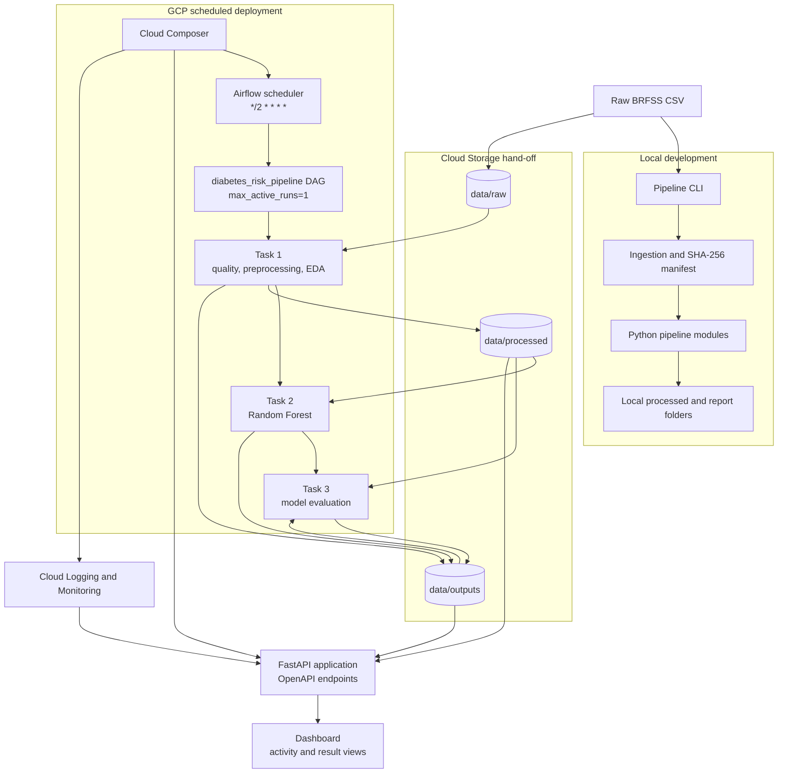

### Execution steps

1. **Select the source:** use the immutable BRFSS CSV from `data/raw/` locally or
  the matching `data/raw/` object in Cloud Storage when running on Composer.
2. **Run ingestion locally:** the CLI validates the schema and row count, then
  appends a timestamped SHA-256 record to the ingestion manifest.
3. **Schedule the cloud path:** Cloud Composer hosts the Airflow DAG, configured
  with `*/2 * * * *`, `catchup=False`, and `max_active_runs=1`; actual runs can
  take longer than the configured schedule interval, as recorded in Section 2.9.
4. **Execute Task 1:** download the raw object to the task workspace, run data
  quality, preprocessing, and EDA, then upload processed datasets, reports, and
  execution logs.
5. **Execute Tasks 2 and 3:** Task 2 trains the Random Forest from the
  model-ready dataset; Task 3 evaluates the models and uploads comparison
  artifacts to Cloud Storage. Their measured runtime is included in the overall
  DAG execution details in Section 2.9.
6. **Serve results:** the FastAPI layer reads pipeline artifacts and GCP runtime
  details, while the dashboard calls the FastAPI endpoints. The dashboard does not
  access Cloud Storage directly or hard-code pipeline results.

### Component boundaries

| Component | Responsibility | Deployment boundary |
|---|---|---|
| `src/diabetes_risk/pipeline/` | Ingestion, validation, preprocessing, EDA, modeling, and logging | Platform neutral; runs locally or in Airflow |
| `dags/diabetes_risk_pipeline.py` | Task ordering, retries, cadence, and overlap policy | Airflow / Cloud Composer |
| Cloud Storage | Raw, processed, report, model, and execution-log objects | GCP persistence layer |
| `src/diabetes_risk/api/` | FastAPI routes and built-in API clients | Application API layer |
| `src/diabetes_risk/dashboard/` | Activity and result presentation through API calls | Presentation layer |
| `tests/` | Automated test suite (pytest) covering ingestion, quality, preprocessing, models, and API routes | Runs locally and as the `ci` job in CI/CD (see "Continuous deployment (CI/CD)" above) |

The API and dashboard are intentionally downstream of the pipeline outputs. They do
not change the raw dataset or run preprocessing themselves. Credentials and project
settings are supplied through environment configuration or Application Default
Credentials; they are not embedded in the DAG or committed to the repository.

**Implementation status:** the pipeline, DAG, Cloud Storage hand-off, and
Composer schedule are implemented and evidenced in Section 2.9, which also
documents the observed run history and end-to-end runtime. The API and dashboard are
implemented, deployed, and tested; live API and dashboard evidence is recorded in
Section 4. The demonstration video remains outstanding.

---

## 1. Business Understanding, Dataset, and Ingestion

### 1.1 Introduction

This section covers the business problem, dataset selection, and data ingestion that the rest of the pipeline (Sections 2-4) builds on. In outline, the pipeline ingests a public health survey dataset, validates and preprocesses it, runs exploratory data analysis, and re-executes automatically on a fixed schedule, with results exposed through both a cloud dashboard and a documented REST API (Swagger/OpenAPI, Section 4).

### 1.2 Project topic

**Diabetes Risk Prediction Using Health and Lifestyle Indicators**

### 1.3 Business problem

Healthcare organizations collect large volumes of patient health and lifestyle data — clinical measurements, lifestyle habits, and demographic indicators — but converting that data into early diabetes-risk screening is difficult in practice. Manual chart-by-chart review does not scale across thousands of patient records, so at-risk individuals are often identified only after symptoms are already present or during unrelated visits, rather than through proactive screening.

This delay has real consequences: patients who could have benefited from early lifestyle intervention or monitoring progress to more advanced, harder-to-manage risk levels, and healthcare providers face higher downstream treatment costs and heavier caseloads that could have been reduced with earlier flagging.

An automated, data-driven risk-screening pipeline addresses this by continuously analyzing available health and lifestyle indicators (e.g., BMI, blood pressure, cholesterol, physical activity, general health status) at the population level, surfacing which risk factors and sub-groups carry elevated diabetes prevalence — a foundation that a future, individual-level scoring system could build on, rather than a system that scores individual patients today.

**Who uses the results:** primarily healthcare providers and care coordinators, who can use the risk-screening output to prioritize outreach and preventive care for higher-risk patients, and secondarily program administrators, who can use the aggregated dashboard view to understand risk distribution across a patient population. The output is explicitly a **risk-screening signal**, not a diagnosis — final clinical decisions remain with a qualified provider.

### 1.4 Current and proposed states

**Current state**

Patient health and lifestyle data is already being collected by healthcare organizations and public health surveys, but it sits largely underused for proactive screening. Identifying which individuals carry elevated diabetes risk still depends on manual review of records or waiting for a clinical visit to prompt investigation, which is time-consuming and inconsistent across large patient populations. Because this analysis is not automated, insights are generated infrequently — often too late to inform early, preventive action — and there is no continuous, systematic way to flag risk as new data arrives.

**Proposed state**

Health and lifestyle data flows through an automated cloud-based pipeline that ingests the dataset, checks and cleans it, and analyzes diabetes-risk indicators (BMI, blood pressure, cholesterol, activity level, general health, etc.) without manual intervention. This analysis reruns on a fixed schedule, so results stay current rather than being a one-time snapshot. The outcomes — risk indicators, key drivers, and pipeline activity — are made visible through a cloud dashboard and exposed through APIs, giving healthcare providers and administrators continuous, up-to-date visibility into risk patterns instead of periodic manual reviews.

### 1.5 Objectives and benefits

**Objectives**

- Ingest and validate a real, sufficiently large public health dataset (BRFSS 2015 diabetes indicators) with automated checks on schema, target column, and row count.
- Preprocess and clean the data (missing-value handling, encoding, normalization) so it is ready for repeatable analysis.
- Run exploratory data analysis (distribution, correlation, binning, feature importance) to surface diabetes-risk indicators.
- Automate the full pipeline on a fixed (2-minute) schedule with execution logging, so results stay current without manual reruns.
- Expose pipeline results and at least four application operations through a documented, testable REST API (Swagger/OpenAPI), and visualize them on a cloud dashboard.

**Benefits**

- **For healthcare providers/care coordinators:** a continuously updated view of which risk factors and population segments carry elevated diabetes prevalence, to help prioritize outreach and preventive-care planning, instead of relying on manual chart review.
- **For program administrators:** an aggregated dashboard view of risk distribution across a patient population, supporting resource and program planning.

### 1.6 Dataset profile

- **Filename:** `diabetes_012_health_indicators_BRFSS2015.csv`
- **Source:** Kaggle — Diabetes Health Indicators Dataset (https://www.kaggle.com/datasets/alexteboul/diabetes-health-indicators-dataset)
- **Row count:** 253,680
- **Column count:** 22
- **Target column:** `Diabetes_012` (0 = no diabetes, 1 = prediabetes, 2 = diabetes)
- **Feature columns:** `HighBP`, `HighChol`, `CholCheck`, `BMI`, `Smoker`, `Stroke`, `HeartDiseaseorAttack`, `PhysActivity`, `Fruits`, `Veggies`, `HvyAlcoholConsump`, `AnyHealthcare`, `NoDocbcCost`, `GenHlth`, `MentHlth`, `PhysHlth`, `DiffWalk`, `Sex`, `Age`, `Education`, `Income`
- **Data types:** All 22 columns are stored as numeric (float64); several are binary flags (0/1) or ordinal codes (e.g. `GenHlth` 1–5, `Age` bucketed 1–13, `Income` 1–8) rather than free-form categories.
- **Missing values:** 0 across all columns (independently verified against the raw CSV).
- **Target-value distribution:** 0.0 → 213,703 (84.2%), 1.0 → 4,631 (1.8%), 2.0 → 35,346 (13.9%) — notably imbalanced, especially the prediabetes class.

**Why this is sufficient:** At 253,680 rows, even the smallest class (prediabetes, 4,631 rows) comfortably supports EDA (correlation analysis, binning, feature importance) and, if a model is included, a held-out test split — a standard 80/20 split still leaves roughly 900+ minority-class examples for evaluation. The dataset's scale also means a full preprocessing + EDA pass is fast enough to comfortably fit inside the assignment's every-2-minute scheduled run.

**Evidence — raw dataset source (Kaggle):**


### 1.7 Data dictionary

All columns are stored as numeric (float64); "Role" marks the prediction target vs. feature. Ranges below are confirmed against the raw CSV, not assumed.

| Column | Business meaning | Values | Role |
|---|---|---|---|
| `Diabetes_012` | Diabetes status | 0 = no diabetes, 1 = prediabetes, 2 = diabetes | Target |
| `HighBP` | Diagnosed with high blood pressure | 0 = no, 1 = yes | Feature (binary) |
| `HighChol` | Diagnosed with high cholesterol | 0 = no, 1 = yes | Feature (binary) |
| `CholCheck` | Cholesterol checked in past 5 years | 0 = no, 1 = yes | Feature (binary) |
| `BMI` | Body Mass Index | 12–98 (continuous) | Feature (numeric) |
| `Smoker` | Smoked ≥100 cigarettes in lifetime | 0 = no, 1 = yes | Feature (binary) |
| `Stroke` | Ever told had a stroke | 0 = no, 1 = yes | Feature (binary) |
| `HeartDiseaseorAttack` | Coronary heart disease or myocardial infarction | 0 = no, 1 = yes | Feature (binary) |
| `PhysActivity` | Physical activity in past 30 days (excl. job) | 0 = no, 1 = yes | Feature (binary) |
| `Fruits` | Consumes fruit ≥1×/day | 0 = no, 1 = yes | Feature (binary) |
| `Veggies` | Consumes vegetables ≥1×/day | 0 = no, 1 = yes | Feature (binary) |
| `HvyAlcoholConsump` | Heavy alcohol consumption (men >14, women >7 drinks/week) | 0 = no, 1 = yes | Feature (binary) |
| `AnyHealthcare` | Has any healthcare coverage | 0 = no, 1 = yes | Feature (binary) |
| `NoDocbcCost` | Needed a doctor but couldn't afford it (past 12 mo.) | 0 = no, 1 = yes | Feature (binary) |
| `GenHlth` | Self-rated general health | 1 = excellent … 5 = poor (ordinal) | Feature (ordinal) |
| `MentHlth` | Days of poor mental health, past 30 days | 0–30 (count) | Feature (numeric) |
| `PhysHlth` | Days of poor physical health, past 30 days | 0–30 (count) | Feature (numeric) |
| `DiffWalk` | Serious difficulty walking/climbing stairs | 0 = no, 1 = yes | Feature (binary) |
| `Sex` | Sex | 0 = female, 1 = male | Feature (binary) |
| `Age` | 13-level age bracket | 1 = 18–24 … 13 = 80+ (ordinal) | Feature (ordinal) |
| `Education` | Education level | 1 = none/kindergarten … 6 = college 4+ years (ordinal) | Feature (ordinal) |
| `Income` | Household income bracket | 1 = <$10k … 8 = $75k+ (ordinal) | Feature (ordinal) |

### 1.8 Suitability and limitations

**Why this dataset suits the assignment**

- **Scale:** 253,680 rows is large enough for statistically meaningful correlation analysis, binning, and feature importance, and still leaves a workable minority-class sample (4,631 rows) if a held-out model evaluation is added.
- **Feature mix:** binary flags (`HighBP`, `Smoker`, …), ordinal scales (`GenHlth`, `Age`, `Education`, `Income`), and continuous counts (`BMI`, `MentHlth`, `PhysHlth`) together give real material for every required EDA activity — correlation, univariate/bivariate analysis, and, once binned (Section 3.4), encoding.
- **Target:** a 3-class label (`Diabetes_012`) supports the required feature-importance work (Section 3.8) and, given its imbalance, gives the EDA and model evaluation a genuine class-imbalance problem to analyze rather than an artificially clean one.
- **Automation-friendly:** no missing values and a manageable file size (~23 MB) mean a full preprocessing + EDA pass runs quickly — important for the every-2-minute scheduled workflow.

**Source and licensing**

Derived from the CDC's public **Behavioral Risk Factor Surveillance System (BRFSS) 2015** survey, cleaned and republished on Kaggle by Alex Teboul (https://www.kaggle.com/datasets/alexteboul/diabetes-health-indicators-dataset) and also mirrored on the UCI Machine Learning Repository. The original 2015 BRFSS survey collected responses from 441,455 individuals across 330 features; this cleaned file keeps 253,680 responses and 21 feature variables plus the target.

**License:** CC0: Public Domain (confirmed directly on the Kaggle dataset page). No attribution or usage restriction applies; the CDC's original BRFSS data is credited as the underlying source in the References section.

**Limitations**

- **Self-report bias:** all fields are self-reported survey answers (smoking, alcohol use, activity, etc.), which are known to be subject to recall error and social-desirability bias (e.g., under-reporting alcohol consumption or over-reporting physical activity).
- **Dataset age:** collected in 2015 — over a decade old, so absolute rates (e.g., smoking, obesity) may not reflect current populations.
- **Generalization:** BRFSS is a U.S.-only telephone survey; findings should not be generalized to non-U.S. populations, and telephone-survey methodology can under-represent some demographic groups.
- **Bias and fairness:** `Income`, `Education`, and `AnyHealthcare`/`NoDocbcCost` reflect healthcare-access disparities as much as biological risk — correlations involving these fields should be discussed as access/equity signals, not purely clinical ones. `Sex` is recorded as a binary field only, per the original survey design.
- **Not a diagnosis:** all outputs remain a **risk-screening signal**, not a clinical diagnosis, as established in Section 1.3.

### 1.9 Data ingestion evidence

Implemented as `src/diabetes_risk/pipeline/ingestion.py` (`ingest()`), covering the required checks: file opens successfully, all 21 expected feature columns plus the `Diabetes_012` target are present, and the row count is recorded and compared against the verified profile (253,680). The raw CSV is never modified or duplicated — each ingestion run instead appends a timestamped, SHA-256-hashed entry to `data/raw/ingestion_manifest.json`, so the exact file used stays verifiable and any future drift (a different file swapped in under the same name) would be visible immediately as a hash or row-count change.

Run with:

```bash
python -m diabetes_risk.pipeline ingest --source data/raw/diabetes_012_health_indicators_BRFSS2015.csv --manifest data/raw/ingestion_manifest.json
```

(The screenshot shows an equivalent earlier CLI form; the underlying ingestion logic is unchanged.)

**Verified result (first import):**

```json
{
  "source_path": "data/raw/diabetes_012_health_indicators_BRFSS2015.csv",
  "imported_at": "2026-09-07T17:10:57.174896+00:00",
  "sha256": "a971809d0786d2d7d7f6070f83dfe8af9d860ea33a79e0e2701c8a49f78f9861",
  "row_count": 253680,
  "column_count": 22,
  "columns_match_expected": true,
  "target_present": true,
  "row_count_matches_expected": true
}
```

Processed output (the preprocessing stage in Section 2) is written to `data/processed/`, kept separate from `data/raw/` so the original file is always preserved untouched. Covered by 5 automated tests in `tests/test_ingestion.py` (valid file, manifest append behavior, missing target column, missing feature column, missing file).

**Evidence — terminal run:**


The tests shown passing are the ingestion suite; the full current suite (Section 2.11) passes 34 tests with 1 skipped. The ingestion run against the real dataset matches the result recorded above exactly (same SHA-256 hash, same row/column counts), confirming it is reproducible outside the verification environment too.

In summary, the business problem, dataset profile, and data dictionary are established and verified against the real file, suitability and limitations are documented with a confirmed CC0 license, and the raw data has been ingested, validated, and logged, providing a verified foundation for the preprocessing stage in Section 2.

---

## 2. Data Quality, Preprocessing, and Pipeline Automation

### 2.1 Scope

This section covers **data-quality validation, preprocessing, automated EDA generation, DataOps execution, two-minute scheduling, execution logging, verification, and handoff to the EDA and modeling stage (Section 3)**. The implementation is deliberately platform-neutral so that the same Python processing code can run locally or under Apache Airflow, with Google Cloud Composer as the deployed production orchestration environment (Section 2.9).

The raw dataset from Section 1 remains immutable. All transformed datasets, analytical artifacts, and execution logs are written to separate `data/processed/` and `data/outputs/` locations.

### 2.2 Data-quality validation

A reusable validation module is implemented in `src/diabetes_risk/pipeline/data_quality.py`. The module validates the approved dataset before preprocessing and produces machine-readable quality results.

The implemented checks include:

- Schema and target-column validation
- Row and column counts
- Pandas data types
- Summary statistics
- Missing-value counts and percentages
- Exact duplicate-record detection
- Target-value validation (`Diabetes_012` must contain only 0, 1, or 2)
- Known numeric-range validation
- Binary indicator validation (0/1)

**Verified source dataset:** `data/raw/diabetes_012_health_indicators_BRFSS2015.csv`

| Quality check | Verified result |
|---|---:|
| Input records | 253,680 |
| Input columns | 22 |
| Missing values | 0 |
| Exact duplicate records | 23,899 (9.42%) |
| Invalid target values | 0 |
| Invalid known numeric-range values | 0 |
| Invalid binary values | 0 |
| Quality status | `PASS_WITH_WARNINGS` |

The duplicate records are treated as a **non-fatal quality warning**, rather than a schema or data-validity failure. The raw file is preserved unchanged, while exact duplicates are removed during preprocessing.

**Summary statistics and data types** (verified against the real 229,781-row cleaned dataset; all 22 columns are stored as `float64`):

| Column | Mean | Std | Min | 25% | Median | 75% | Max |
|---|---:|---:|---:|---:|---:|---:|---:|
| `Diabetes_012` | 0.33 | 0.72 | 0 | 0 | 0 | 0 | 2 |
| `HighBP` | 0.45 | 0.50 | 0 | 0 | 0 | 1 | 1 |
| `HighChol` | 0.44 | 0.50 | 0 | 0 | 0 | 1 | 1 |
| `CholCheck` | 0.96 | 0.20 | 0 | 1 | 1 | 1 | 1 |
| `BMI` | 28.69 | 6.79 | 12 | 24 | 27 | 32 | 98 |
| `Smoker` | 0.47 | 0.50 | 0 | 0 | 0 | 1 | 1 |
| `Stroke` | 0.04 | 0.21 | 0 | 0 | 0 | 0 | 1 |
| `HeartDiseaseorAttack` | 0.10 | 0.30 | 0 | 0 | 0 | 0 | 1 |
| `PhysActivity` | 0.73 | 0.44 | 0 | 0 | 1 | 1 | 1 |
| `Fruits` | 0.61 | 0.49 | 0 | 0 | 1 | 1 | 1 |
| `Veggies` | 0.79 | 0.40 | 0 | 1 | 1 | 1 | 1 |
| `HvyAlcoholConsump` | 0.06 | 0.24 | 0 | 0 | 0 | 0 | 1 |
| `AnyHealthcare` | 0.95 | 0.23 | 0 | 1 | 1 | 1 | 1 |
| `NoDocbcCost` | 0.09 | 0.29 | 0 | 0 | 0 | 0 | 1 |
| `GenHlth` | 2.60 | 1.06 | 1 | 2 | 3 | 3 | 5 |
| `MentHlth` | 3.51 | 7.71 | 0 | 0 | 0 | 2 | 30 |
| `PhysHlth` | 4.68 | 9.05 | 0 | 0 | 0 | 4 | 30 |
| `DiffWalk` | 0.19 | 0.39 | 0 | 0 | 0 | 0 | 1 |
| `Sex` | 0.44 | 0.50 | 0 | 0 | 0 | 1 | 1 |
| `Age` | 8.09 | 3.09 | 1 | 6 | 8 | 10 | 13 |
| `Education` | 4.98 | 0.99 | 1 | 4 | 5 | 6 | 6 |
| `Income` | 5.89 | 2.09 | 1 | 5 | 6 | 8 | 8 |

This table gives concrete values for the "Pandas data types" and "Summary statistics" checks listed above, rather than naming them as checklist items only; it was computed directly from `data/processed/diabetes_cleaned.csv` for this report.

Quality artifacts generated by the pipeline are:

```text
data/outputs/quality/data_quality.json
data/outputs/quality/missing_values.csv
```

### 2.3 Preprocessing and cleaned-data generation

The transformation contract is implemented in `src/diabetes_risk/pipeline/preprocessing.py`. The preprocessing flow is applied consistently on every pipeline execution:

1. Normalize column names to lowercase snake case for downstream processing consistency.
2. Detect and remove exact duplicate records, retaining the first occurrence.
3. Median-impute numeric missing values where required.
4. Mode-impute non-numeric values where required.
5. One-hot encode non-numeric categorical fields where required.
6. Preserve existing binary and ordinal indicators in interpretable form.
7. Keep the target separate from feature standardization.
8. Write an analytical cleaned dataset for the EDA stage (Section 3).
9. Write a separate standardized model-ready dataset for optional downstream model work.

For the current approved dataset, no imputation was required because the raw file contains **zero missing values**. Likewise, no one-hot categorical encoding was required in the current run because the dataset fields are already represented as numeric, binary, or ordinal values.

The current execution produced:

| Output | Result |
|---|---:|
| Input rows | 253,680 |
| Exact duplicates removed | 23,899 |
| Cleaned analytical rows | 229,781 |
| Cleaned columns | 22 |
| Model-ready rows | 229,781 |
| Model-ready columns | 22 |

### 2.4 Analytical cleaned dataset vs. model-ready dataset

Two processed datasets are intentionally maintained rather than applying the same transformation to both analytical and modeling use cases.

**`data/processed/diabetes_cleaned.csv`** is the primary handoff to the EDA stage (Section 3). It retains the original, interpretable feature scales so that BMI, health-day counts, age groups, and other indicators remain meaningful in EDA charts and tables.

**`data/processed/diabetes_model_ready.csv`** is a separate downstream modeling output. Z-score standardization is applied to the continuous/count fields `BMI`, `MentHlth`, and `PhysHlth`, while binary and ordinal indicators remain interpretable and the target is not scaled.

This separation satisfies the assignment's normalization/standardization requirement without making the EDA outputs harder to interpret. It also leaves the optional model-comparison stage (Section 3.8) free to use the model-ready dataset.

The preprocessing module writes its transformation summary to:

```text
data/processed/preprocessing_report.json
```

### 2.5 Automated EDA artifact generation

This section automates the **generation** of the EDA artifacts in `src/diabetes_risk/pipeline/eda.py`. Section 3 remains responsible for the analytical interpretation and final EDA narrative.

Each successful pipeline run refreshes the following outputs:

- Summary statistics
- Missing-value summary
- Target-distribution table and chart
- Feature-distribution charts
- Correlation matrix
- Selected bivariate tables and charts
- Age/BMI binned features
- EDA metadata

The automated feature-distribution outputs cover eight selected indicators:

- BMI
- Age
- General Health
- High Blood Pressure
- High Cholesterol
- Physical Activity
- Cholesterol Check
- Smoking

The automated bivariate outputs cover six selected relationships against the diabetes target:

- BMI vs. target
- Age vs. target
- High Blood Pressure vs. target
- High Cholesterol vs. target
- Physical Activity vs. target
- General Health vs. target

This design allows the EDA artifacts to be refreshed automatically without requiring manual notebook reruns or chart regeneration downstream.

### 2.6 End-to-end DataOps runner

`src/diabetes_risk/pipeline/runner.py` provides the single end-to-end execution path used for both local execution and Airflow orchestration:

```text
Raw CSV
  ↓
Data-quality validation
  ↓
Preprocessing
  ├── diabetes_cleaned.csv
  └── diabetes_model_ready.csv
  ↓
Automated EDA artifact generation
  ↓
Structured execution log
```

The runner records the status of each execution and writes outputs to predictable locations. The verified full-dataset local execution (run ID `20260912T025251232582Z`) started at `2026-09-12T02:52:51.232576Z`, completed at `2026-09-12T02:52:56.336563Z`, and finished in **5.10 seconds**. It read all **253,680** raw records and produced the expected 229,781-row processed outputs.

### 2.7 Verified full-dataset execution result

To remove ambiguity about the size of the data actually processed, this section identifies **one fresh, successful end-to-end run** against the complete raw CSV as the authoritative record. No two-record test fixture is represented in the retained pipeline outputs or execution results — the test suite continues to use small fixtures for unit testing, but the execution documented here is the full production-like local run against the 253,680-row source file, and its input/output counts match the quality-validation table in Section 2.2 and the preprocessing table in Section 2.3.

| Execution metric | Verified result |
|---|---:|
| Run ID | `20260912T025251232582Z` |
| Input file | `data/raw/diabetes_012_health_indicators_BRFSS2015.csv` |
| Execution status | `SUCCESS` |
| Quality status | `PASS_WITH_WARNINGS` |
| Runtime | **5.10 seconds** |

The post-duplicate-removal target distribution produced by this run is interpreted in Section 3.3 (distinct from the raw, pre-deduplication distribution in Section 1.6).

The authoritative execution record is stored at:

```text
data/outputs/execution/run_20260912T025251232582Z.json
data/outputs/execution/latest_run.json
```

The generated EDA artifacts, quality report, cleaned dataset, and model-ready dataset all correspond to this same full-dataset execution.

### 2.8 Execution logging and monitoring information

`src/diabetes_risk/pipeline/logging_utils.py` implements structured JSON execution logging. Each pipeline run records:

- Unique run ID
- Start timestamp
- End timestamp
- Runtime duration
- Execution status
- Number of input/processed records
- Number of output records
- Duplicate count
- Errors
- Warnings
- Quality status
- Processed-output locations
- EDA-output locations

Execution artifacts are written under:

```text
data/outputs/execution/run_<run_id>.json
data/outputs/execution/latest_run.json
```

A trimmed excerpt from an independently rerun execution log, confirming the schema above is populated with real values:

```json
{
  "run_id": "20260923T133736609860Z",
  "started_at": "2026-09-23T13:37:36.609849+00:00",
  "ended_at": "2026-09-23T13:37:46.233842+00:00",
  "duration_seconds": 9.623993,
  "status": "SUCCESS",
  "input_rows": 253680,
  "output_rows": 229781,
  "duplicates_detected": 23899,
  "errors": [],
  "warnings": [
    "One or more non-fatal data-quality checks require review."
  ]
}
```

### 2.9 Airflow orchestration and two-minute schedule

`dags/diabetes_risk_pipeline.py` implements the orchestration layer using **Apache Airflow**. Each task invokes the same platform-neutral Python runner and pipeline modules used for local execution.

The core pipeline logic in `src/diabetes_risk/pipeline/` contains no GCP SDK imports, GCS-specific operators, Vertex AI operators, or cloud credentials, so the same code runs unchanged locally or under Airflow. The orchestration wrapper in `dags/diabetes_risk_pipeline.py` is the one GCP-specific layer — it uses the Google Cloud Storage client to move data between tasks, detailed below — and it contains no Vertex AI operators and no credentials embedded in the repository.

The configured schedule is:

```text
*/2 * * * *
```

The DAG schedule is configured to trigger every two minutes. Each run performs data-quality checks, preprocessing, automated EDA generation, and the optional Random Forest/model-evaluation tasks described in Section 3.8. The observed total task runtime is recorded separately below; the schedule interval and task runtime describe different aspects of execution.

The reliability configuration includes:

- `catchup=False` to avoid replaying historical schedules during deployment.
- `max_active_runs=1` to prevent overlapping pipeline executions.
- One retry with a one-minute retry delay for transient task failures.

The production deployment target is **Google Cloud Composer**, which provides
managed Apache Airflow, and is deployed and verified below. The Python processing modules remain platform-neutral, while
`dags/diabetes_risk_pipeline.py` uses the Google Cloud Storage client to download raw
inputs and upload processed datasets, reports, models, and execution logs between
Composer tasks. Deployment and architecture details are documented in this report
and the root README.

#### Cloud Composer deployment verification

The DAG was deployed to a live **Google Cloud Composer** environment to verify the configured schedule under managed-orchestration infrastructure, separate from local Airflow unit testing.

| Deployment detail | Value |
|---|---|
| GCP project | `diabetes-risk-group49` |
| Composer environment | `diabetes-risk-env` |
| Location | `us-central1` |
| Airflow version | `2.11.1` |
| Confirmed schedule interval (Composer console) | `*/2 * * * *` |

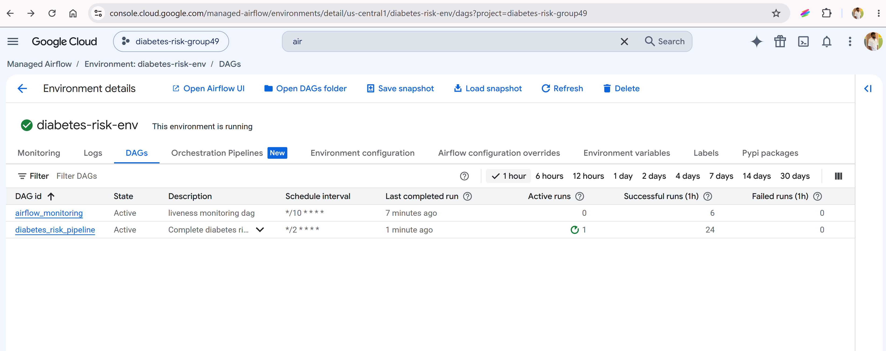

The Cloud Storage bucket managed by the environment is used as the data hand-off between Airflow tasks: the raw dataset is read from `data/raw/`, and processed/EDA/model outputs are written back to `data/processed/` and `data/outputs/`.

The selected Composer run, `scheduled__2026-09-23T10:14:00+00:00`, completed successfully across all three tasks: `data_quality_preprocessing_and_eda`, `random_forest`, and `model_evaluation`.

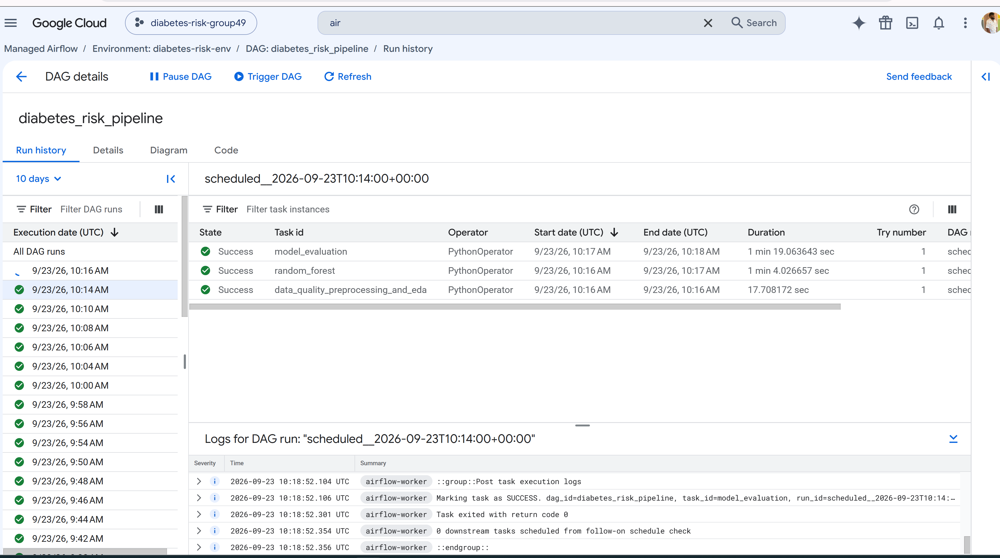

An earlier one-hour console snapshot showed 10 failed runs before the current authenticated view above (24 successful, 0 failed, 1 active); the failures were not individually root-caused, and the newer status reflects the deployment's current behavior. The deployed `/api/v1/schedule` endpoint also returned `RUNNING` for the Composer environment. The Cloud Console page is available at https://console.cloud.google.com/managed-airflow/environments/detail/us-central1/diabetes-risk-env/dags?project=diabetes-risk-group49.

**Schedule and runtime observations:** the DAG's configured schedule is `*/2 * * * *`. The displayed history includes run starts at 9:48, 9:50, 9:54, 9:58, 10:00, and 10:04. The selected run's three tasks took 17.7 s + 64.0 s + 79.1 s, or about 2 minutes 41 seconds end to end. These figures report the configured interval, observed run history, and measured task runtime separately. Most of the measured runtime came from Random Forest training and model evaluation; the required data-quality/preprocessing/EDA work alone completes locally in about 5–10 seconds (Section 2.6).

### 2.10 Configuration and local execution

Environment-driven configuration is provided through `src/diabetes_risk/pipeline/config.py`, along with a unified command-line entry point through `src/diabetes_risk/pipeline/cli.py`.

The pipeline can therefore be executed locally without GCP dependencies. The main commands are:

```bash
python -m diabetes_risk.pipeline ingest
python -m diabetes_risk.pipeline run
```

The default configuration uses the repository's raw dataset and separates processed and reporting outputs. Environment variables can override the dataset, target column, processed-output directory, and report-output directory when the same code is deployed to another environment.

### 2.11 Verification and test results

This implementation was verified using both automated tests and an end-to-end run against the real repository dataset.

**Automated verification** (full current suite, independently rerun for this report):

```text
34 passed, 1 skipped
```

The one skipped test is Airflow-specific because an Airflow runtime is not installed in the local development environment. Airflow is intentionally kept outside the core Python dependency set because it is expected to be supplied by the orchestration runtime, such as Cloud Composer.

Additional validation completed successfully:

- Python source compilation using `compileall`
- End-to-end execution against the actual 253,680-row raw CSV
- Generated processed datasets and EDA artifacts verified at the expected output locations

### 2.12 Evidence summary

This report is the record for the local validation and Cloud Composer evidence.

The verified local evidence includes:

- Dataset validation
- Summary statistics and data types
- Missing-value results
- Duplicate-record results
- Invalid-value results
- Preprocessing results
- Cleaned dataset output
- Model-ready output
- Automated EDA outputs
- Structured execution log
- Airflow DAG configuration

**Deployment evidence:** the Composer screenshots in Section 2.9 confirm the `*/2 * * * *` schedule on an Active DAG and show a selected run with all three tasks successful. The history and task runtime are included as execution details.

### 2.13 Summary

The approved dataset has been validated, quality checks and preprocessing are automated, cleaned and model-ready datasets are generated, EDA artifacts are refreshed by the workflow, and structured execution logging is implemented. The Airflow DAG is configured for a two-minute schedule with an explicit overlapping-run policy; measured task runtime and Composer run history are reported in Section 2.9. The available automated verification suite passed at the time documented above. This section does **not** implement final dashboarding or the four required application APIs; those are covered in Section 4.

---

## 3. EDA, Optional Model, and Dashboard Analysis

### 3.1 Scope

This section covers interpretation of the automated EDA outputs from Section 2, plus an optional (not required by the assessment) predictive-model comparison built on top of the model-ready dataset. It does not implement the dashboard or the four required application APIs; those are covered in Section 4.

**Source:** the EDA interpretation and feature/correlation charts in Sections 3.2-3.7 are drawn from `Diabetes_EDA_Person3.pptx`, the original analysis deck for this section (not included in this export; available in the team's repository). The target-distribution chart below was refreshed from the automated EDA run against the current raw CSV on 23 September 2026, after exact-duplicate removal; its values match the 229,781-row analytical dataset documented in this report. Section 3.8's model implementation, evaluation, and evidence were rerun for this report (see Section 3.9 for the reproducibility distinction between the two).

### 3.2 Dataset overview and completeness

The interpretation is based on the analytical dataset produced in Section 2 after exact-duplicate removal:

| Metric | Value |
|---|---:|
| Analyzed records | **229,781** |
| Variables | **22** |
| Target classes | **3** (`Diabetes_012`) |
| Missing values | **0** (0.0% across every field) |

The 21 features (plus the `Diabetes_012` target) group into five categories: clinical (high BP, high cholesterol, cholesterol check, stroke, heart disease), lifestyle (physical activity, smoking, fruit/vegetable intake, heavy alcohol consumption), healthcare access (any healthcare coverage, cost-related doctor avoidance), health status (BMI, general/mental/physical health, mobility), and demographic (age band, education, income, sex).

Because the missing-value summary reports zero missing observations across all 22 analyzed variables, no rows required exclusion for missingness at this stage; this conclusion applies specifically to the processed analytical dataset used for these outputs.

### 3.3 Target distribution

The target is strongly imbalanced, particularly for the prediabetes class. Figures below are **post-duplicate-removal** (229,781 rows); see Section 1.6 for the raw, pre-deduplication distribution:

| `Diabetes_012` | Records | Percentage |
|---:|---:|---:|
| 0 — No diabetes | 190,055 | 82.71% |
| 1 — Prediabetes | 4,629 | 2.01% |
| 2 — Diabetes | 35,097 | 15.27% |

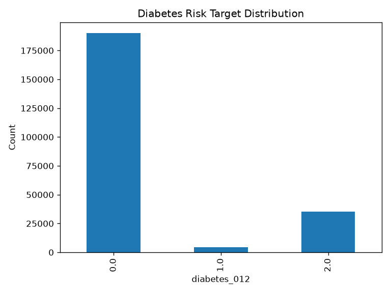

**Modeling implication:** with this degree of imbalance, accuracy alone is not a reliable measure of model quality. Class-level precision, recall, and F1-score must be reported alongside it — this is confirmed empirically in Section 3.8 below.

### 3.4 Feature distribution analysis

The population combines high cardiometabolic exposure with widespread reported physical activity:

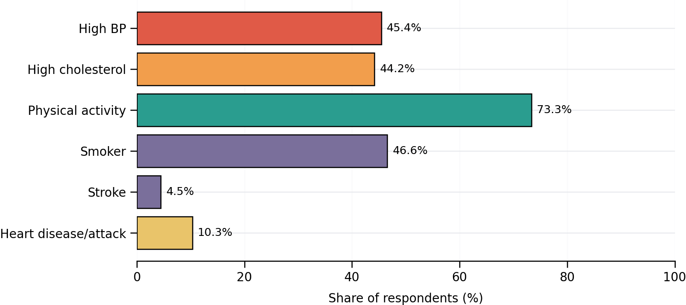

Selected distribution statistics:

| Feature | Mean | Median | Range / Scale |
|---|---:|---:|---|
| BMI | 28.69 | 27 | 12 to 98 |
| Age band | 8.09 | 8 | 1 to 13 |
| General health | 2.60 | 3 | 1 to 5 |

High BP and high cholesterol each affect nearly half of respondents (45.4% and 44.2% respectively), while 73.3% report physical activity, 46.6% have smoked at least 100 cigarettes in their lifetime (the `Smoker` field's definition — not current smoking), 10.3% report heart disease/attack, and 4.5% report a prior stroke.

**Binned features**

The pipeline also generates two categorical binnings of continuous/ordinal features on every run, written to `data/outputs/eda/binned_features.csv`: a 4-level `AgeGroup` derived from the existing 13-level age bracket (Section 1.7: level 1 = 18–24, level 13 = 80+), and a 4-level `BMIGroup` using standard clinical BMI categories (Underweight < 18.5, Normal 18.5–25, Overweight 25–30, Obese ≥ 30).

| AgeGroup (age-bracket levels) | Records | Share | Diabetes rate (class 2) |
|---|---:|---:|---:|
| 1-4 | 34,839 | 15.16% | 3.32% |
| 5-7 | 54,489 | 23.71% | 10.76% |
| 8-10 | 86,205 | 37.52% | 19.03% |
| 11-13 | 54,248 | 23.61% | 21.52% |

| BMIGroup | Records | Share | Diabetes rate (class 2) |
|---|---:|---:|---:|
| Underweight | 3,053 | 1.33% | 5.54% |
| Normal | 73,736 | 32.09% | 7.26% |
| Overweight | 81,555 | 35.49% | 14.00% |
| Obese | 71,437 | 31.09% | 25.42% |

Diabetes prevalence rises with both bins: from 3.32% in the youngest age-bracket group to 21.52% in the oldest, and from 5.54% among underweight respondents to 25.42% among the obese — both consistent with the positive BMI and age correlations reported in Section 3.5. These counts were independently recomputed for this report by running the pipeline against the real 229,781-row cleaned dataset, to verify the binning output empirically rather than describing it from the artifact list alone.

**Encoding.** `generate_eda()` now one-hot encodes the two binned categorical features as part of every scheduled run — `AgeGroup` into 4 indicator columns and `BMIGroup` into 4 indicator columns — by passing `bin_frame` through the same `preprocessing.encode_features()` used elsewhere in the codebase, and writes the result to `binned_features_encoded.csv` alongside a `binned_features_encoding_report` entry in `eda_metadata.json`. Re-run directly against the real 229,781-row cleaned dataset for this report, the encoded sums reproduce the binning tables above exactly (`AgeGroup_8-10` sums to 86,205; `BMIGroup_Obese` sums to 71,437). No categorical encoding was needed for the pipeline's other 21 features, since they arrive already numeric, binary, or ordinal (Section 2.3); the binned age/BMI groups are the dataset's only genuinely categorical (non-ordinal) fields, so this is where the assignment's encoding activity (1.4) applies.

### 3.5 Correlation analysis

Associations with `Diabetes_012` are modest; no single feature dominates:

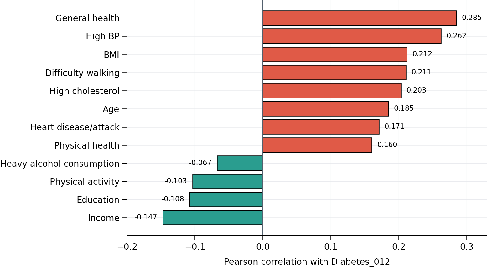

| Strongest positive | r | Strongest negative | r |
|---|---:|---|---:|
| General health | +0.285 | Income | −0.147 |
| High BP | +0.262 | Education | −0.108 |
| BMI | +0.212 | Physical activity | −0.103 |
| Difficulty walking | +0.211 | Heavy alcohol consumption | −0.067 |
| High cholesterol | +0.203 | | |

Correlation indicates association, not causation.

### 3.6 Bivariate analysis

Six priority features were compared against the ordered diabetes outcome:

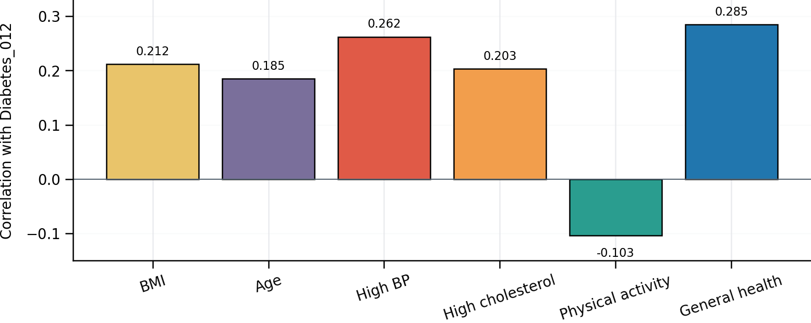

General health has the strongest of the six associations (+0.285). High BP (+0.262), BMI (+0.212), and high cholesterol (+0.203) all rise with the ordered target, and age is positively associated (+0.185). Physical activity is inversely associated (−0.103).

**Interpretation boundary:** these values summarize linear association; they do not prove a causal effect or substitute for group-level significance tests.

### 3.7 Consolidated EDA findings

- **Data quality:** 229,781 complete records; zero missing values across all 22 analyzed fields.
- **Target risk:** 82.71% of records are class 0; prediabetes is only 2.01%, creating severe class imbalance.
- **Health signals:** general health, high BP, BMI, mobility difficulty, and high cholesterol show the largest positive associations with the target.
- **Negative associations:** income, education, and physical activity show the largest negative correlations with the target — read as access/equity signals for income and education (Section 1.8), not purely protective clinical effects, and as association rather than a causal claim (Section 3.5).

### 3.8 Optional model implementation and evaluation

A Random Forest is trained to produce the feature-importance evidence required by activity 1.4; it is then compared against a Logistic Regression baseline on accuracy, precision, recall, and F1 as additional, non-required analysis — the assessment PDF does not ask for a model comparison or a deployed prediction service.

**Implementation:** `src/diabetes_risk/pipeline/randomforestclassifier.py` trains a Random Forest (200 trees, `random_state=42`, no `class_weight` argument set, i.e. classes are left unweighted) on an 80/20 stratified train/test split (183,824 train / 45,957 test records) and saves feature importances. `src/diabetes_risk/pipeline/model_evaluation.py` reproduces the same split, trains a Logistic Regression model (`class_weight="balanced"`, all 21 feature columns `StandardScaler`-normalized — including the binary/ordinal fields that Section 2.4's model-ready dataset otherwise leaves unscaled, since Logistic Regression benefits from uniformly scaled inputs while Random Forest does not need it), and evaluates both models side by side. Because only Logistic Regression is trained with class-weight balancing, the comparison below reflects both the algorithm difference and this imbalance-handling difference, not the algorithm alone. Both are exposed as CLI subcommands (`python -m diabetes_risk.pipeline randomforestclassifier` and `python -m diabetes_risk.pipeline model_evaluation`) and as separate Cloud Composer DAG tasks (Section 2.9).

**Verified local run result** (executed against the real 229,781-row model-ready dataset):

| Model | Accuracy | Balanced Accuracy | Precision (weighted) | Recall (weighted) | F1 (weighted) |
|---|---:|---:|---:|---:|---:|
| Logistic Regression | 62.92% | **51.35%** | 83.69% | 62.92% | 70.33% |
| Random Forest | **82.47%** | 38.39% | 77.42% | 82.47% | 78.74% |

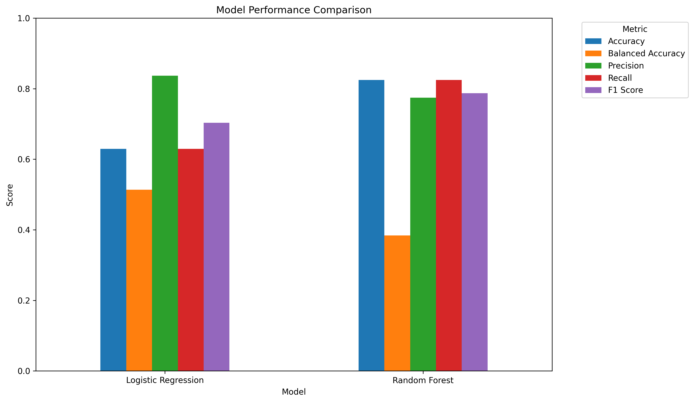

**Random Forest has the higher raw accuracy but the lower balanced accuracy — this is the class-imbalance effect flagged in Section 3.3, and it shows up directly in the per-class results.** Random Forest's classification report scores 0.0 recall and F1 for class 1 (prediabetes): it never *correctly* predicts a prediabetes case (0 of 926 true prediabetes cases). It does output class 1 sixty-one times in total, all of them wrong, so its class-1 precision is also 0.0. Logistic Regression, trained with `class_weight="balanced"`, trades off overall accuracy for materially better minority-class **recall**: 30.3% on class 1 and 59.3% on class 2 — but that recall comes at a steep **precision** cost, not a class-0-precision cost as such trade-offs are sometimes assumed to work: only 3.2% of Logistic Regression's class-1 predictions are actually correct (281 of 8,659), and its class-0 **recall** drops to 64.4% (vs. 96.2% for Random Forest), even though its class-0 **precision** is actually slightly *higher* than Random Forest's (94.3% vs. 84.9%).

| Random Forest confusion matrix | Pred 0 | Pred 1 | Pred 2 |
|---|---:|---:|---:|
| True 0 | 36,568 | 55 | 1,389 |
| True 1 | 820 | **0** | 106 |
| True 2 | 5,682 | 6 | 1,331 |

| Logistic Regression confusion matrix | Pred 0 | Pred 1 | Pred 2 |
|---|---:|---:|---:|
| True 0 | 24,469 | 6,729 | 6,814 |
| True 1 | 265 | 281 | 380 |
| True 2 | 1,206 | 1,649 | 4,164 |

**Per-class precision and recall** (recomputed directly from the confusion matrices above, since the weighted metrics in the summary table mask class-1 performance entirely):

| Model | Class | Precision | Recall |
|---|---|---:|---:|
| Random Forest | 0 — No diabetes | 84.90% | 96.20% |
| Random Forest | 1 — Prediabetes | 0.00% | 0.00% |
| Random Forest | 2 — Diabetes | 47.10% | 18.96% |
| Logistic Regression | 0 — No diabetes | 94.33% | 64.37% |
| Logistic Regression | 1 — Prediabetes | 3.25% | 30.35% |
| Logistic Regression | 2 — Diabetes | 36.66% | 59.32% |

**Conclusion:** neither model is production-ready for the minority prediabetes class, and accuracy alone would have hidden this — Random Forest's 82.5% accuracy looks strong until the per-class breakdown shows it never correctly identifies a prediabetes case, and Logistic Regression's "materially better" 30.3% recall on that same class still means fewer than 1 in 30 of its prediabetes predictions are right. This confirms the EDA's own modeling-implication warning (Section 3.3) with actual model results rather than assumption. Note also that this comparison mixes two differences at once — the algorithm (Random Forest vs. Logistic Regression) and the imbalance handling (`class_weight="balanced"` was applied only to Logistic Regression) — so it should be read as "a balanced linear baseline vs. an unweighted ensemble," not as a clean like-for-like algorithm comparison.

Covered by automated tests in `tests/test_randomforestclassifier.py` (verifies the model artifact, feature-importance CSV/plot, and that the target column is excluded from feature importances) and `tests/test_model_evaluation.py` (verifies both models train, all comparison/report/confusion-matrix artifacts are written, and that evaluation fails clearly if the Random Forest model has not been trained first). Both use synthetic fixtures via pytest's `tmp_path`; the full current suite passes 34 tests with 1 skipped (Section 2.11).

**Feature importance** (Random Forest, top 10 of 21):

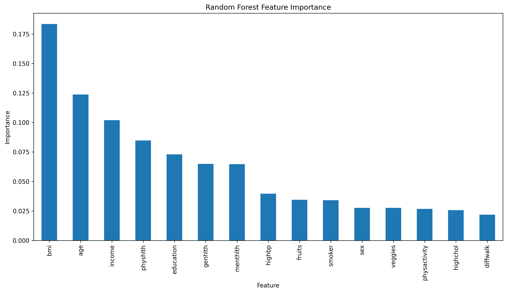

| Feature | Importance |
|---|---:|
| BMI | 0.183 |
| Age | 0.124 |
| Income | 0.102 |
| Physical health (days) | 0.085 |
| Education | 0.073 |
| General health | 0.065 |
| Mental health (days) | 0.065 |
| High BP | 0.040 |
| Fruits | 0.035 |
| Smoker | 0.034 |

Note that Random Forest's feature-importance ranking (BMI, age, income) differs from the EDA's linear-correlation ranking (general health, high BP, BMI). Some of this is genuine: impurity-based feature importance captures non-linear and interaction effects that Pearson correlation (Section 3.5) does not. But this importance metric (mean decrease in impurity, the scikit-learn default) is also known to be biased toward high-cardinality and continuous features over low-cardinality binary ones — which is a more parsimonious explanation for why continuous/wide-range fields (`BMI`, `Age`, `Income`, `PhysHlth`) rank above binary fields like `HighBP` here, despite `HighBP` having a stronger linear correlation with the target. A permutation-importance or SHAP analysis was not run for this report and would be needed to separate the two effects conclusively.

### 3.9 Known limitations

- The feature-distribution, correlation, and bivariate charts in Sections 3.4-3.6 remain static images from the standalone Person 3 analysis deck; no checked-in script regenerates those exact presentation charts. The target-distribution chart in Section 3.3 and the binned-feature table in Section 3.4 were both refreshed from the automated EDA pipeline on 23 September 2026. The model-evaluation charts and metrics in Section 3.8 were independently regenerated and are reproducible via the two CLI commands listed above.
- The optional model (Section 3.8) is not integrated into the automated `run()` pipeline; it runs as separate CLI commands and Composer DAG tasks, consistent with its optional, additive analysis scope.
- The Composer schedule is configured for every two minutes; measured task runtime and observed run history are documented in Section 2.9.
- Logistic Regression's "materially better" minority-class recall (Section 3.8) comes with very low precision (3.25% for class 1); neither model would be usable in a real screening tool without further tuning, threshold adjustment, or a different modeling approach.
- The deployed API (Section 4) is intentionally public and unauthenticated for grading convenience; it is read-only and exposes no write operations or secrets beyond a project ID and a service-account email, but this is not the authentication posture a production deployment would use.
- Every scheduled run reprocesses the same static, immutable 2015 survey file rather than new incoming data; the two-minute automation demonstrates the required DataOps mechanics, not a live data-ingestion pipeline reacting to new records.


---

## 4. Dashboard, APIs, and Demonstration

### 4.1 Activity dashboard

The dashboard is served by `src/diabetes_risk/dashboard/app.py` and reads all
application values from the FastAPI service; it does not embed run or dataset
results. The latest completed Composer status and its whole-DAG duration are
shown in summary cards for quick visibility; in-progress runs remain in the
10-row Composer history table, which shows state, timestamps, duration, and
expandable task-instance details. The
separate processing cards show **Processed Records**, duplicate removals,
quality status, and processing error/warning counts, which do not appear in
the Composer history. These come from the GCS execution manifest
and dataset reports. The record count is the pipeline's **input** row count
(253,680), not the 229,781-row cleaned output. A Composer Environment card
shows the environment name, state, Airflow version, and configured two-minute
DAG schedule. Optional model-comparison metrics appear in the chart. DAG and
task timestamps are displayed in UTC to match Composer. GCS pipeline manifests
remain available separately through `/api/v1/pipeline/history`.

Run the API and dashboard in separate terminals after configuring GCP access:

```powershell
uvicorn diabetes_risk.api.main:app --reload --host 127.0.0.1 --port 9000
uvicorn diabetes_risk.dashboard.app:app --reload --host 127.0.0.1 --port 8000
```

Open `http://127.0.0.1:8000/` for the dashboard and
`http://127.0.0.1:9000/docs` for Swagger/OpenAPI. The dashboard's four required
application details map to the following endpoints:

| API | Purpose | Method | Data source | Authentication / expected status |
|---|---|---|---|---|
| Workflow | Recent scheduled DAG runs | GET `/api/v1/workflow` | Cloud Composer Airflow REST API | Runtime service account needs `roles/composer.user` and Airflow read access |
| Workflow task details | Task states and timings for a DAG run | GET `/api/v1/workflow/{dag_run_id}/tasks` | Cloud Composer Airflow REST API | Same Composer/Airflow permissions |
| Pipeline execution history | Recent processing manifests | GET `/api/v1/pipeline/history` | GCS execution manifests (`data/outputs/execution/`) | Application ADC; 200 when objects exist |
| Latest execution | Run status, duration, counts, errors, warnings | GET `/api/v1/runs/latest` | GCS `data/outputs/execution/latest_run.json` | Application ADC; 200 when object exists |
| Dataset processing | Row/column counts, duplicates, missing values, quality status | GET `/api/v1/dataset` | GCS quality and preprocessing JSON reports | Application ADC; 200 when objects exist |
| Schedule/deployment | Composer environment state and Airflow version | GET `/api/v1/schedule` | Cloud Composer Environments API | Application ADC; 200 when authorized |
| Optional model detail | Comparison metrics and top feature | GET `/api/v1/model` | GCS model-evaluation and feature-importance CSVs | Application ADC; 200 when objects exist |

A sixth, undocumented-in-the-UI endpoint, `GET /api/v1/health/environment`, also exists and reads real Composer environment health metrics from **Cloud Monitoring** (`google.cloud.monitoring_v3`) — this is the "Cloud Logging/Monitoring" service listed in the Platform Selection table earlier in this report; it is not one of the four required endpoints and is not covered by dedicated screenshots in Section 4.2. `gcp_service.py`'s `get_task_instance_status()` returns per-task state and duration through `GET /api/v1/workflow/{dag_run_id}/tasks`, which the dashboard loads when a Composer run's **Tasks** button is opened.

`/health` and `/api/v1/metadata` are also available without GCP access. The dashboard workflow history now reads up to 10 DAG runs from the Composer Airflow REST API; each run can be expanded to show task-instance state and timing. This route uses an OAuth-authenticated ADC session. The Cloud Run runtime service account must be allowed to access the Composer environment, its Airflow user must have read access to DAGs and task instances, and Composer web server access control must permit the request. The GCS-backed processing history remains available through `/api/v1/pipeline/history`. After this source change is deployed, verify the endpoint and refresh its screenshots; the current checked-in live screenshots predate the Composer-backed history. The schedule/deployment route continues to use the Composer Environments API, and environment health uses Cloud Monitoring.

### 4.2 Live verification and evidence

The deployed dashboard and API were opened through the public Cloud Run URLs on
23 September 2026. The screenshots currently in this report show the earlier
GCS-manifest version of workflow history. The Composer-backed history change in
the current source has not yet been deployed and captured in updated screenshots.
Refresh the dashboard and workflow API evidence after deployment before final
submission.

**Deployed services:**

- Dashboard: https://diabetes-risk-dashboard-573458509120.us-central1.run.app/
- Swagger/OpenAPI: https://diabetes-risk-api-573458509120.us-central1.run.app/docs

**1. Workflow — recent Composer DAG runs**
`GET https://diabetes-risk-api-573458509120.us-central1.run.app/api/v1/workflow`. The current source calls the Composer Airflow REST API and returns up to 10 recent DAG runs. Capture the live status and response after deploying the source change; the existing screenshot shows GCS pipeline manifests and must be refreshed.

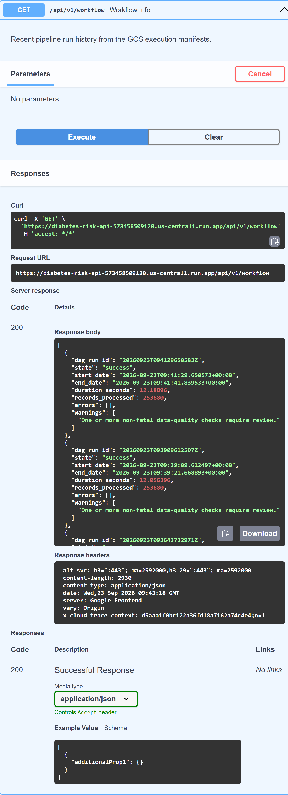

**2. Latest execution — detailed latest run status and metrics**
`GET https://diabetes-risk-api-573458509120.us-central1.run.app/api/v1/runs/latest`. Public Cloud Run URL, no credentials prompted. Live response: 200; `20260923T094129650583Z`, `SUCCESS`, 253,680 input records.

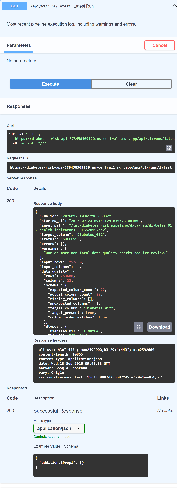

**3. Dataset processing — dataset and quality metrics**
`GET https://diabetes-risk-api-573458509120.us-central1.run.app/api/v1/dataset`. Public Cloud Run URL, no credentials prompted. Live response: 200; 253,680 input rows, 229,781 output rows, 23,899 duplicates removed, 0 missing values after processing, `PASS_WITH_WARNINGS`.

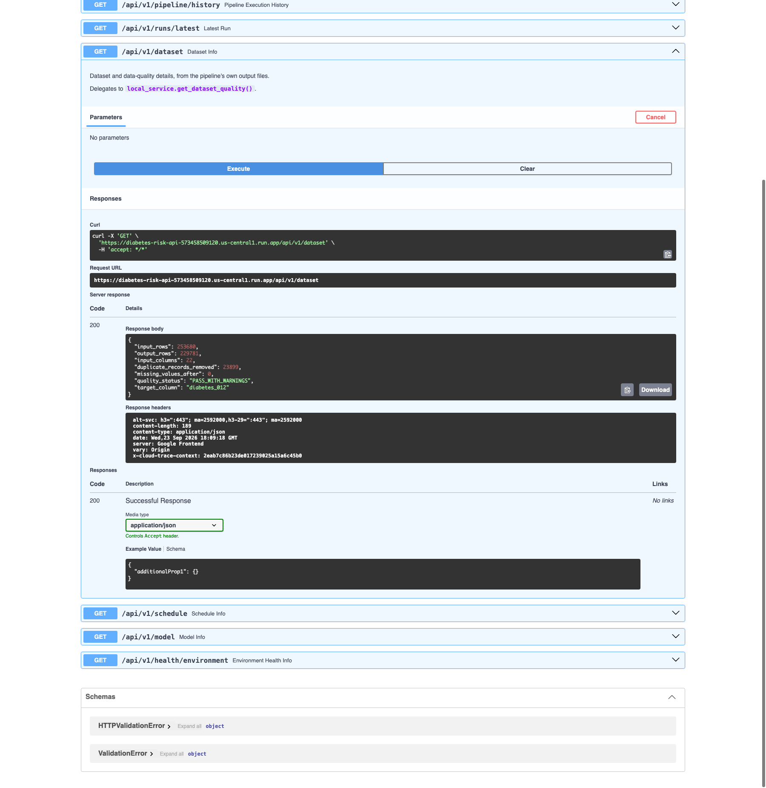

**4. Schedule/deployment — Composer environment status and version**
`GET https://diabetes-risk-api-573458509120.us-central1.run.app/api/v1/schedule`. Public Cloud Run URL, no credentials prompted. Live response: 200; `diabetes-risk-env` is `RUNNING`; Composer 3 / Airflow 2.11.1.

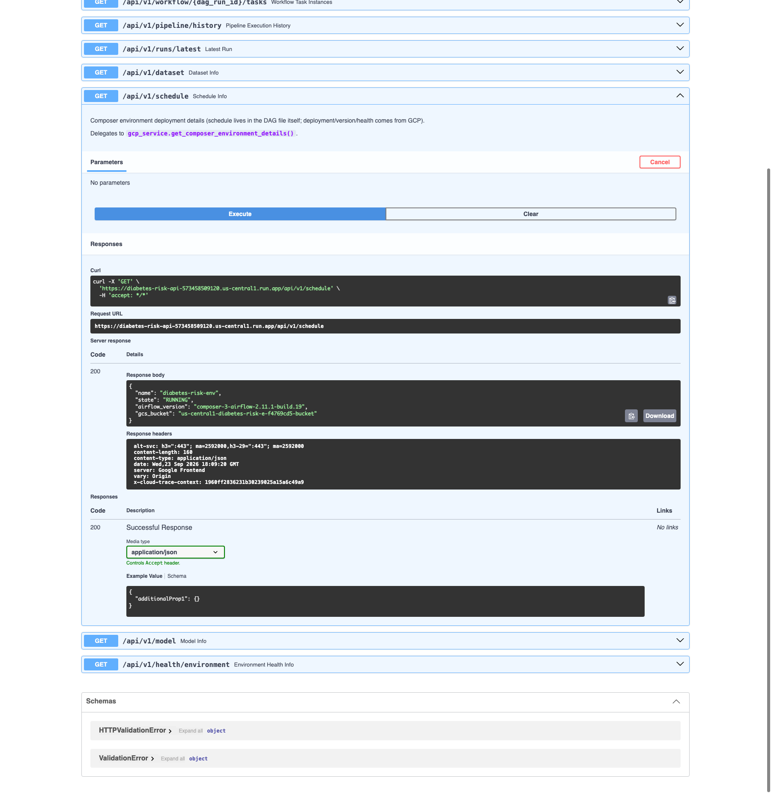

The existing dashboard screenshot records the deployed view before the history
source change. Refresh it to show the Composer DAG Run History table and an
expanded task list. The dashboard source page is
[https://diabetes-risk-dashboard-573458509120.us-central1.run.app/](https://diabetes-risk-dashboard-573458509120.us-central1.run.app/):

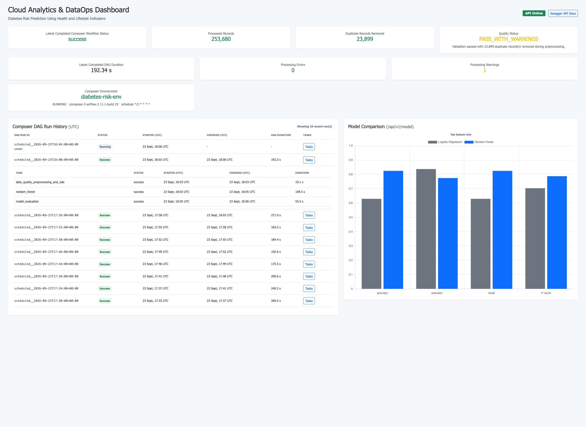

The API and dashboard screenshot evidence above is current as of 23 September 2026. The demonstration video required by the brief remains to be recorded and added as a shared Google Drive link before final submission.

---

## 5. Conclusion, Limitations, and Future Work

**Conclusion.** The repository implements the business understanding, ingestion, preprocessing, EDA (including binning, encoding, and feature importance), a DataOps workflow configured on a two-minute schedule, a cloud dashboard, and four documented API details. Section 2.9 reports the configured schedule, observed run history, and measured task runtime. The dashboard source now uses Composer DAG history with expandable task details and retains GCS pipeline manifests through a separate endpoint. Deploy this change and refresh the live API/dashboard evidence before submission. The optional model comparison is reported with its limitations. The demonstration video required by the assessment remains outstanding and will be added later.

**Cross-cutting limitations**, consolidating the per-section notes in Sections 2.9, 3.9, and 4.1:

- The Composer-backed `/api/v1/workflow` change has not yet been deployed and verified with refreshed live evidence (Section 4.1).
- Neither comparison model is precise enough on the minority prediabetes class to be usable in a real screening tool (Section 3.8).
- The demonstration video and each member's individual confirmation of their contribution entry remain outstanding at the time of this export.

**Future work:** deploy and verify the Composer-backed `/api/v1/workflow` route, refresh the dashboard/API screenshots, and record and link the demonstration video; retrain Random Forest with class-weight balancing (or apply a decision threshold adjustment) to give a fairer, less confounded model comparison; and add permutation or SHAP-based feature importance to separate genuine signal from the impurity-based ranking's bias toward high-cardinality features.

---

## References

1. Centers for Disease Control and Prevention (CDC). *Behavioral Risk Factor Surveillance System (BRFSS) 2015.* Original survey data underlying the dataset used in this project.
2. Teboul, A. *Diabetes Health Indicators Dataset.* Kaggle, cleaned and republished from CDC BRFSS 2015 data. https://www.kaggle.com/datasets/alexteboul/diabetes-health-indicators-dataset (CC0: Public Domain).
3. UCI Machine Learning Repository. *CDC Diabetes Health Indicators* (mirror of the same underlying BRFSS 2015 data).
4. Pedregosa, F. et al. *Scikit-learn: Machine Learning in Python.* Journal of Machine Learning Research, 12, 2011. (Random Forest and Logistic Regression implementations, Section 3.8.)
5. Apache Software Foundation. *Apache Airflow Documentation.* https://airflow.apache.org/docs/ (DAG orchestration, Section 2.9.)
6. Google Cloud. *Cloud Composer, Cloud Storage, Cloud Run, and Cloud Monitoring Documentation.* https://cloud.google.com/docs (platform services used throughout Sections 2 and 4.)
